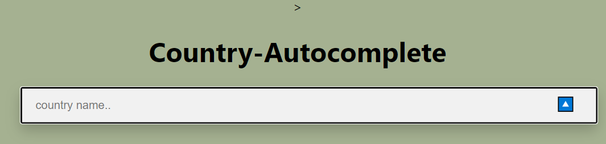

# React Functional Component

---

### Try my App - https://ramabadash.github.io/Country-Autocomplete-React/

---

### App pics -

---

### Empty-close

### Empty-open

### With text - close

### With text - open

---

### Resources

[React Hooks at reactjs.org](https://reactjs.org/docs/hooks-intro.html)
[Write Your own Hook](https://reactjs.org/docs/hooks-custom.html)

### Assignment

- You are going to build a country autocomplete component ([like this one](https://codesandbox.io/s/56iuf?file=/demo.js))
- Use [CountriesJson](https://gist.github.com/keeguon/2310008) for data

1. you will need to use the following hooks:
   1. useState - to select the country from the dropdown
   2. useEffect - to show matching countries when the input has changed
   3. useRef - to show/hide dropdown
2. components suggestion:
   1. SearchBar
   2. OptionsDropdown
   3. Option
   4. ClearButton
   5. ToggleButton
3. Once you finish writing you app, write & implement a custom hook for common functionality

-deployment- github repo + screenshot of working component
